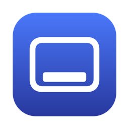

<p align="center">
  
</p>

# Revzen

Revzen brings Windows-style taskbar behavior to the macOS Dock. It runs as a menu bar app.

Developer: Kerem Gök ([x.com/KogOglan](https://x.com/KogOglan))

## Install

```
brew install --cask KilimcininKorOglu/tap/revzen
```

Or download `Revzen.dmg` from the [latest release](https://github.com/KilimcininKorOglu/Revzen/releases/latest) and drag Revzen to Applications.

## Features

- **Click to minimize.** Click the icon of the active app to minimize its focused window. Click it again to restore that window. Modified clicks (Command, Option, Control, Shift) keep their Dock meaning.
- **Window previews.** Hover a Dock icon to see a preview of each window of the app, with the window title under it. The previews are in alphabetical order of the titles. Click a preview to bring that window to the front, restoring it when minimized.
- **Close from the preview.** Close a window with the "x" in the corner of its preview, or with a middle click on the preview. The app may still ask to save changes.
- **Minimized windows.** Minimized windows appear in the preview with their last image. When macOS cannot supply that image, the preview shows the last image Revzen took of the window: during previews, before a Dock click minimizes a window, when an app stops being active, and every 10 seconds for the active app. Without either image, the tile shows the app icon.
- **Scroll to switch.** Scroll over a Dock icon to bring the app's windows to the front one after another, in the order they were created.
- **Spaces.** Optionally show windows from other Spaces in the preview.
- **Updates.** Revzen finds new releases and installs them in place (see [Updates](#updates)).
- **Settings.** Preview delay, excluded apps, other Spaces, launch at login, the automatic update check and debug logging. Revzen does nothing for an excluded app: the Dock handles its clicks, and it gets no preview or scroll switching.
- **Appearance.** The preview panel and the Settings window use system materials and colors, so they follow the light and dark appearance.

## Requirements

- macOS 15 or later
- Accessibility permission: Dock clicks, scroll handling and window control
- Screen Recording permission: window previews

Revzen asks for both permissions on first launch. You can also grant them from the menu bar menu or the Settings window.

Launch at login is on by default. The first launch registers Revzen as a login item once. If you turn it off, it stays off.

## Updates

Revzen checks GitHub for a new release once a day. Choose "Check for Updates…" in the menu bar menu to check at once. You can turn the daily check off in Settings.

When a new release is available, a window shows its release notes. Revzen downloads the release and verifies it before it replaces the running app:

- The download matches the checksum that GitHub recorded for the release.
- The download carries a valid signature from the Revzen release key.
- The app is signed by the developer and notarized by Apple.

A failed check stops the update and shows the reason. When Revzen is in a folder that your account cannot write, macOS asks for an administrator password. Homebrew users can also update with `brew upgrade --cask revzen`.

## Diagnostics

To report a problem, turn on Settings > Diagnostics > Debug logging and reproduce the problem. Revzen writes every Dock click, hover, scroll, preview, window and update event to `~/Library/Logs/Revzen/revzen.log`. "Show in Finder" opens the folder. The log includes the window titles and names of other apps, so only your user account can read it. Check the file before you share it, and delete it with "Delete Log" when you no longer need it. Turning debug logging off keeps the file. Debug logging is off by default and turns off again when Revzen quits, so turn it on again after a restart. When the file grows past 5 MB, Revzen renames it to `revzen.log.1` and starts a new file, so the logs use at most about 10 MB.

## Compatibility

Revzen uses private macOS interfaces for window images, minimized windows and other Spaces, as similar Dock tools do. A future macOS update can remove them. The preview then shows the app icon or an earlier image instead of the current window image, and lists only the current Space.

Revzen is not available in the Mac App Store, because the Accessibility permission it needs is not allowed for sandboxed apps.

## Development

See [DEVELOPMENT.md](DEVELOPMENT.md) for building, testing, the project structure and the release process.

## License

MIT. See [LICENSE](LICENSE).
